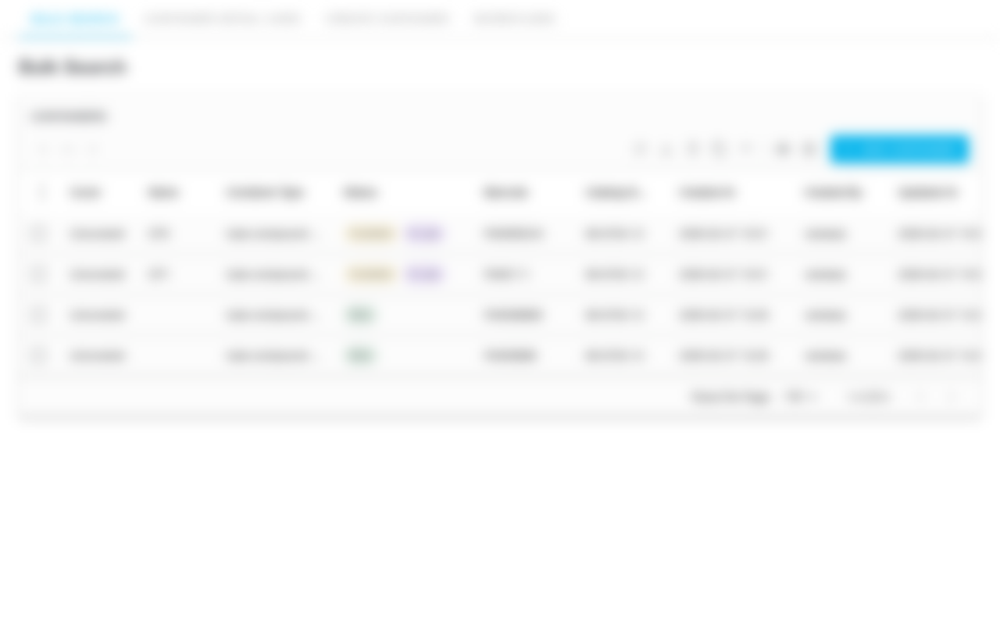
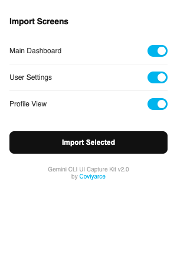

# 🚀 Gemini CLI UI Capture Tool for Figma

A powerful toolkit for **UI-to-Design** synchronization. This tool captures live web interfaces (localhost or production) and recreates them as high-fidelity, editable vector layers in Figma using a local development plugin.

Built specifically to bridge the gap in environments where the native Figma MCP `capture_ui` tool is not directly exposed, allowing developers to maintain a perfect sync between their code and their design canvas.

---

## 🖼 Visual Preview

### High-Fidelity UI Capture
The toolkit captures complex web interfaces with pixel-perfect accuracy, preserving the hierarchy, typography, and styling of your Design System.



### Modern Figma Plugin UI
A sleek, toggle-based interface allows you to selectively import multiple screens and resolutions directly into your Figma workspace.



---

## ✨ Features & Evolution

This tool evolved through rigorous iteration to achieve near-perfect design fidelity:

- **1.0: Basic Capture** - Initial implementation of DOM scanning.
- **2.0: Multi-Resolution** - Support for dual-view captures (e.g., 1080p and 720p) to test responsiveness.
- **3.0: Precision Alignment** - Added support for CSS Flexbox, Padding, and Text Alignment, ensuring content is centered exactly as in the browser.
- **4.0: High Fidelity** - Support for `box-shadow` (translated to Figma Drop Shadows), full borders, and corner radii.
- **5.0: Vector & Icons** - Real SVG extraction and rendering using Figma's vector engine. Support for Icon fonts and automatic color synchronization with design themes.

---

## 🛠 Prerequisites

### CLI Side (Development Environment)
- **Node.js** (v16 or higher)
- **Puppeteer**: Used to drive the headless browser for pixel-perfect UI extraction.
- **Gemini CLI / MCP**: Configured with Figma MCP permissions.

### Figma Side
- **Figma Desktop App** (Recommended for local plugin development).
- **Figma Account**: Permissions to import local plugins.

---

## 🚀 Quick Start

### 1. Installation
Clone this toolkit into your project or as a standalone tool:
```bash
git clone https://github.com/coviyarce/gemini-cli-ui-capture.git
cd gemini-cli-ui-capture
npm install
```

### 2. Configure Screens
Edit `capture-config.json` to define the screens you want to capture:
```json
{
  "baseUrl": "http://localhost:[YOUR_PORT]",
  "screens": [
    { "id": "dashboard", "name": "Main Dashboard", "selector": "main" },
    { "id": "settings", "name": "Settings Page", "selector": ".settings-container" }
  ]
}
```

### 3. Capture your UI
Run the capture script to generate the UI blueprint. Ensure your local dev server is running.
```bash
npm run capture
```
This generates `ui-structure.json` containing the detailed map of your interface.

### 4. Update the Plugin
Sync the captured data into the Figma plugin code:
```bash
npm run update-plugin
```

### 5. Run in Figma
1. Open Figma -> Menu -> **Plugins** -> **Development** -> **Import plugin from manifest...**
2. Select the `figma-plugin/manifest.json` file from this folder.
3. Run **"UI Sync Plugin"**.
4. The tool will detect your current viewport center and create frames with editable vector layers.

---

## 📂 Repository Structure

- `scripts/capture-to-figma.cjs`: The core engine that uses Puppeteer to scan the DOM and styles.
- `scripts/update-plugin.cjs`: Utility to inject captured data into the Figma plugin.
- `figma-plugin/`: The local Figma plugin source code.
  - `manifest.json`: Plugin configuration.
  - `code.template.js`: The logic for drawing nodes in Figma (Text, Frames, SVGs, Shadows).
  - `code.js`: The active plugin file (generated).

---

## 🔒 Security & Privacy
This tool is designed for private use. It does **not** store or transmit your Figma credentials or personal access tokens. All capture data remains local to your machine until you run the plugin within your authorized Figma session.

---

## 🤝 Attribution
Created and maintained by [**Coviyarce**](https://github.com/coviyarce/gemini-cli-ui-capture). 
Built with 💎 Gemini CLI.
